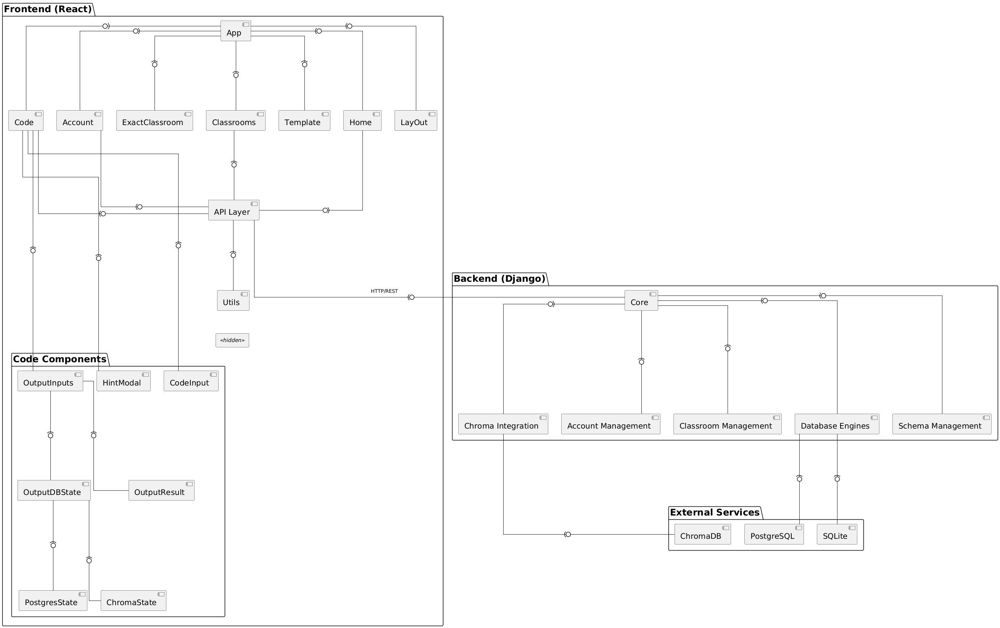
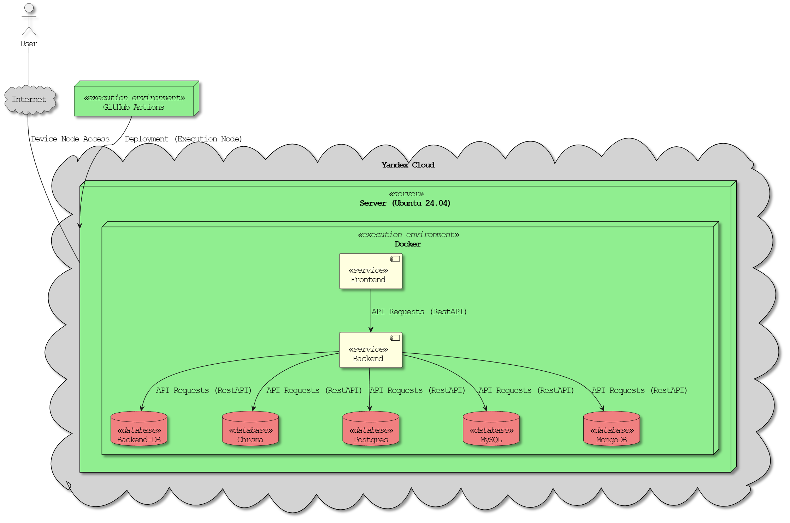

## Architecture

### Static view

Database Playground is an educational platform for interactive database learning, featuring a **React**frontend and **Django** backend. It supports **PostgreSQL**, **ChromaDB**, and **SQLite**, and is deployed via **Docker Compose** with CI/CD automated by **GitHub Actions**.

#### Architectural Layers

The frontend’s App component handles global state and routing, with page modules (Home, Classrooms, ExactClassroom, Account, Template), an interactive Code Editor, and specialized ChromaDB and PostgreSQL UI components. A utility layer provides API clients and helpers. The backend offers REST endpoints in Django, delegates domain logic to service modules (accounts, classrooms, schemas), and uses a Database Engines adapter for multi‑DB support.

#### Deployment Architecture

Docker Compose isolates frontend, backend and databases with environment‑specific configs. A GitHub Actions workflow runs tests (pytest, Django tests) and flake8 linting on main‑branch pushes before deployment.

#### Coupling and Cohesion

Clean REST interfaces and a database adapter pattern ensure loose coupling; containerization further isolates services. High cohesion is achieved by single‑responsibility React components and domain‑focused backend services.

#### Maintainability (ISO 25010)

- **Modularity**  
  Clear layering between frontend, backend, and utility modules; pluggable Database Engines adapters allow individual components to be extended or replaced with minimal ripple effects.

- **Reusability**  
  Centralized API abstraction and utility functions; database‑specific UI components (ChromaState, PostgresState) designed for reuse across multiple views.

- **Analysability**  
  Consistent file/folder structure, clear naming conventions, comprehensive README documentation and quality‑attribute scenarios; CI/CD logs provide transparent build and test reporting.

- **Modifiability**  
  React’s component‑based design localizes UI changes; Django service‑layer abstractions contain backend modifications; Docker Compose configurations isolate environment‑specific adjustments.

- **Testability**  
  Robust backend test suite (pytest + Django TestCase) and automated linting (flake8) integrated into GitHub Actions; each service container can be spun up in isolation for targeted integration tests.

### Dynamic view

All measurements were taken in a production‐like environment (React frontend, Dockerized Django backend, AWS RDS PostgreSQL):

#### Performance Metrics
- **User Authentication:** 120–200 ms
- **Cookie initialization**: 50-60 ms
- **PostgreSQL Schema Fetch:** 150–250 ms
- **Chroma command Execution:** 250–500 ms
- **PostgreSQL command Execution:** 200–400 ms
- **Token refresh:** 10-15 ms

### Deployment view

The project is deployed in Yandex Cloud on an Ubuntu 24.04 server using Docker containers, with GitHub Actions automating the CI/CD process. Customers access the "Frontend" via a web browser over the Internet. For customers to run the project on their own server, they must add their server's username, IP address, and SSH key to GitHub secrets and then trigger the "Deploy Project" workflow. The "Frontend" communicates with the "Backend" via RestAPI, which in turn interacts with "Backend-DB," "Chroma," "Postgres," "MySQL," and "MongoDB," all running securely within Docker on the server.
